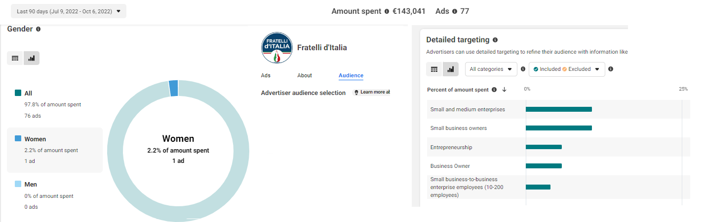
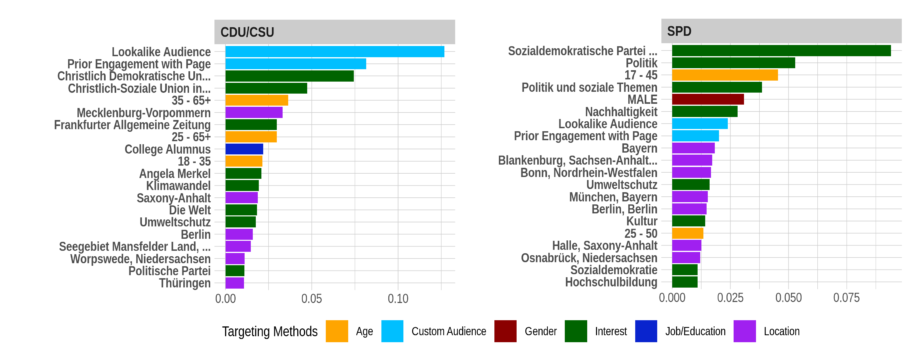
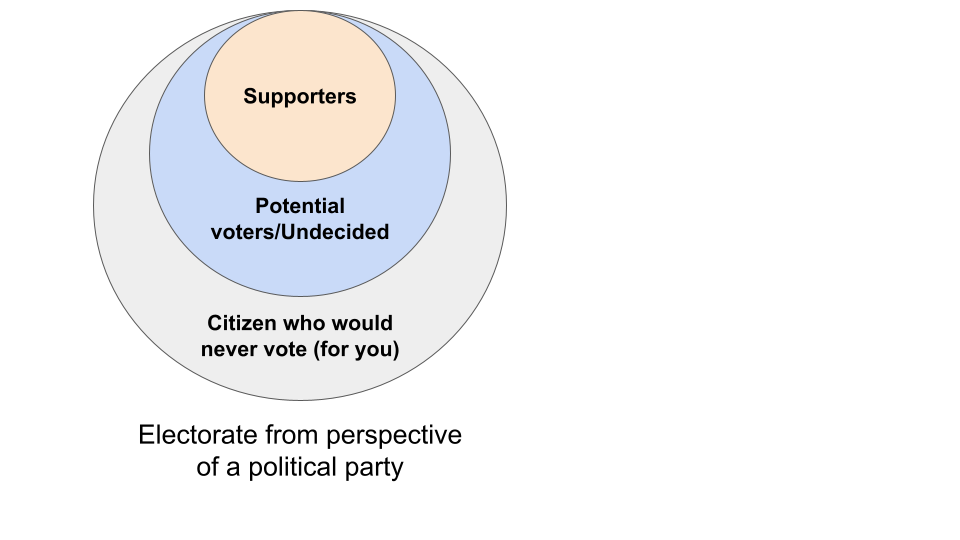
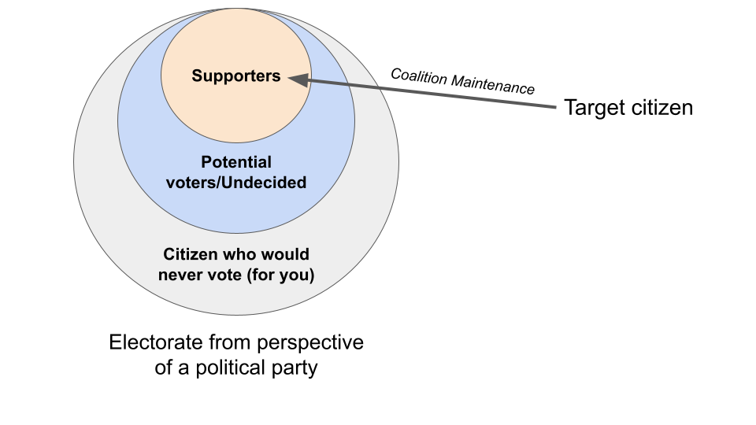
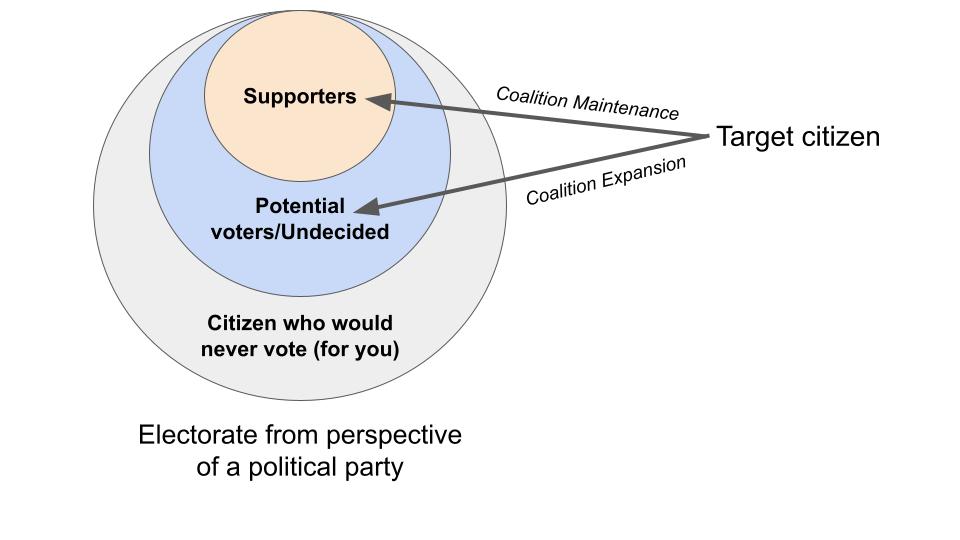
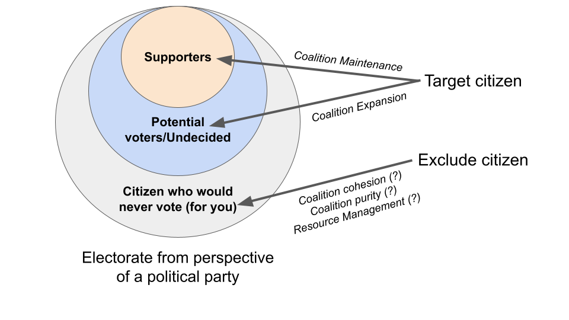
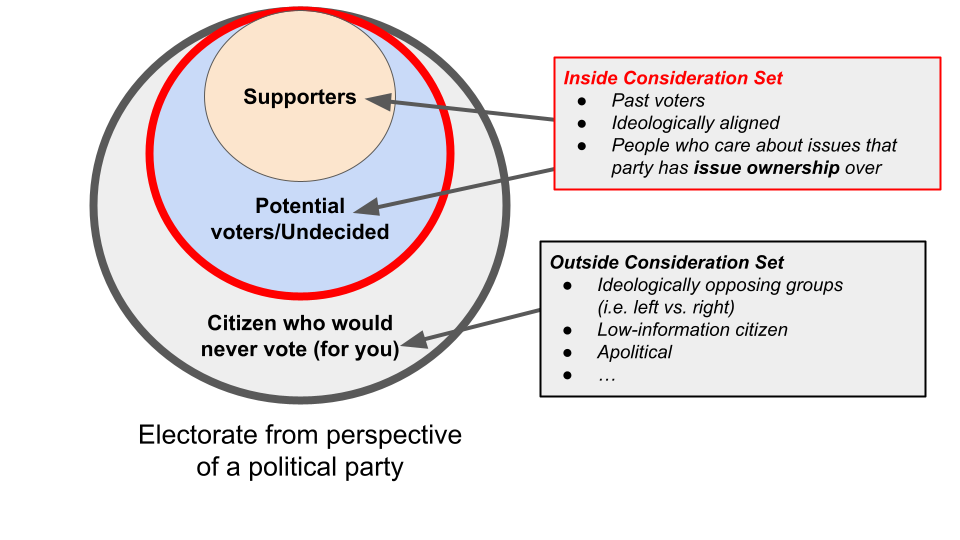

layout: true
    
<div class="logo"></div> 


```{r setup, include=FALSE}
# Here you can place global options for the entire document.
# Mostly used for knitr settings, but can also load data etc.
# Whatever happens here will not show in the presentation.
knitr::opts_chunk$set(fig.retina = 3, 
                      warning = FALSE, 
                      message = FALSE,
                      echo = F)


library(tidyverse)

source("../algo_ads/helpers.R")

# dir("../img", recursive = T, full.names = T) %>%
#   walk(~{file.copy(.x, str_remove(.x, "\\.\\.\\/"))})
```


---

### Data on Ad Targeting

+ Past: Data on Ad Targeting is hard to come by
     
     + only accessible via data donations ("Why am I seeing this?")
     
     + scarce coverage and biased data (only from those who volunteer their data)

--

<br>

+ February 2021 Meta gives *vetted researchers* access to an "ad targeting dataset"

    + **Actual** targeting criteria used in Social Issue, Electoral, and Political (SIEP) ads on the **ad-level**
    
    + through the FORT platform (**F**acebook **O**pen **R**esearch and **T**ransparency) 
    
    + Timeframe: August 3rd - November 1st , 2020
    
    + Coverage: Only the United States
    
    + Difficult to get access
    
---


### Data on Ad Targeting


+ September 2022: Meta adds "Audience" tab to public Meta Ad Library  

    + Coverage: All countries in which political ads run
    
    + Targeting criteria: Age, Gender, Location, Language, "Interests" and "Behaviour", Custom and Lookalike Audiences 
    
    + Downside: only available for last 7, 30, and 90 days windows
    
    + No possibility to download data (however: I've written an R package to be released to access data)
        



        
---

### Data on Ad Targeting

+ September 2022: FORT applications open to everyone
    
    + Ad targeting data now includes:
    
        + All countries in which political ads run
        
        + Coverage: August 3rd, 2020 - today (monthly updates)
        
        + No possibility to download data (as before)


    

---

### FORT data structure

The following is available to us now:

Targeting and Exclusion (!) of Audiences by

+ Age

+ Gender

+ Location

+ (Friend) Connections

+ "Interests" and "Behaviour"

+ Custom and Lookalike audiences (however, no more details than that)

---

class: middle, center

### For the first time we can investigate the usage of online political microtargeting at scale and worldwide using a very comprehensive (but probably not 100% complete) data source

---


class: middle, center

### Tentative research question:

# Who are political parties including and excluding when they target their advertisements?

---


### Previous studies suggest advertisers on Meta primarily target own supporters

**Fowler et al. 2021** conclude in their comprehensive study on Meta ad targeting in the 2018 US midterm election


> "all point[s] toward the use of social media ads for **mobilization of existing supporters** as opposed to persuasion of marginal voters"

<!-- based on three factors: -->

<!-- + reduced negativity -->
<!-- + lower issue content -->
<!-- + increased partisanship -->

<!-- compared to TV ads -->

**Ridout et al. 2021:**

> More than 50% of ads are **acquisition, fundraising, and mobilization** ads in selected Senate races on Meta.

**Stuckelberger and Koedam 2022:**

> Our analysis across five countries [...] suggests that **coalition maintenance** is the dominant party strategy for demographic groups.

---

class: white

### Evidence that parties target supporters (WTM data)



---

class: middle, center

## Theories for who gets targeted & 
## who gets excluded


---

### Theories for who gets targeted & who gets excluded


#### Coalition Maintenance vs. Expansion strategies 

*Based on Rohrschneider 2002; Panagopoulos and Wielhouwer 2008; Stuckelberger and Koedam 2022*

<br>

+ **Coalition maintenance strategy** (*"mobilizing"*)

    + Reach out to people who are past and present supporters to strengthen coalition 

+  **Coalition expansion strategy** (*"chasing"*)

    + Target people who are potential voters or yet undecided to expand coalition 


---

### Theories for who gets targeted & who gets excluded


#### **Consideration sets** 

*(Based on Oscarsson and Rosema 2019)*

+ Originally a marketing theory on consumer behaviour: 
    + set of products that consumer would be willing to buy based on certain criteria 
        + for example, price, brand, etc.


+ In electoral context: 
    + set of political parties citizen would vote for based on certain criteria 
        + e.g. ideological alignment, chances to govern, be in parliament, etc.
    
<br>
    
+ **In targeting context (from perspective of campaigns):**
    + set of audiences that a party chooses to advertise to 
        + e.g. based on **issue ownership**, past vote, ideological alignment, etc.
    + implies: audiences outside of consideration sets should be excluded
    

---

class: white

### A theory for who gets targeted & who gets excluded



---

class: white

### A theory for who gets targeted & who gets excluded




---

class: white

### A theory for who gets targeted & who gets excluded




---

class: white

### A theory for who gets targeted & who gets excluded




---


class: white

### A theory for who gets targeted & who gets excluded




---

## Hypotheses

> Parties target audiences within consideration set

> Parties exclude audiences outside their consideration set

Maybe:

> Smaller parties are more likely to engage in coalition expansion rather than coalition maintenance in an effort to gain votes from bigger competitors

---


## Requirements

1. Decide which elections should be studied

    + Suggestion: Netherlands 2021, Germany 2021, Canada 2021, Italy 2022, Sweden 2022, Denmark 2023 (?)
    + other elections: Lithuania 2020, Portugal 2020, Liechtenstein 2021, Bulgaria 2021, Cyprus 2021, Norway 2021, Iceland 2021, Czech Republic 2021, Hungary 2022, Slovenia 2022
    
2. Coding of targeting criteria into 
    
    +  **in consideration set**
        + Supporters                 
        + Potential voters       
        
    +  **outside of consideration set**
        + People who are not likely to vote for party
    
> requires some expertise in studied countries

Question: what about targeting criteria that do not fit in any of these categories?

---

## Who targets who and why but.. also how?

+ So this research design does not incorporate at all **which messages** parties use to target people.

+ Is this a major flaw? Reasonable compromise?

### More questions

Does the theory idea make sense?

Any other suggestions?

Problem with the theory: what about political parties that want to **demobilize supporters of the opposing party**? That's not accounted for. However: is this even an issue outside of the US?
